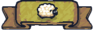
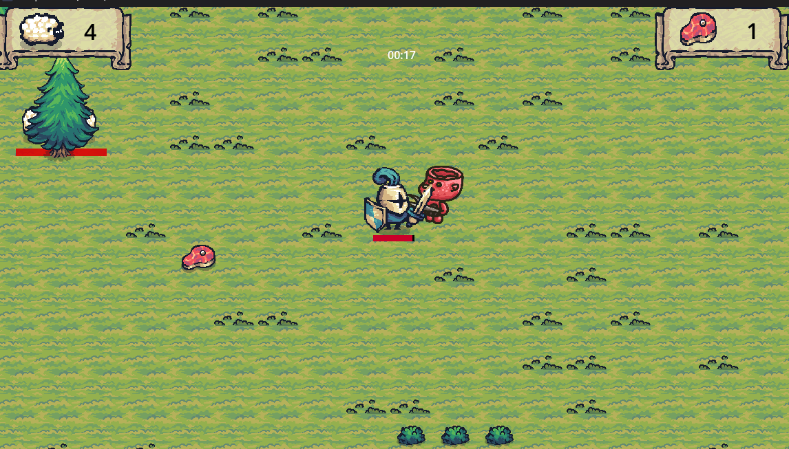

<picture>
  

</picture>

# Sheep Defender
Sheep Defender é um protótipo de um jogo no estilo "top-down" em que você assume o papel de um cavaleiro medieval com o objetivo de proteger as ovelhas do reino, enquanto combate globins, demônios e vilões.

# Suporte e Ferramentas

Este projeto foi desenvolvido completamente usando [Godot Engine 4.2.2](https://godotengine.org/) com GDScript. Não há qualquer outra dependência. A ideia inicial foi desenvolver um protótipo de jogo de sobrevivência, seguindo a ideia do Professor Rafael Stogg, que conduziu o BootCamp (patrocinado pelo Santander) de Desenvolvimento de Jogos em Godot.

No [projeto original](https://github.com/digitalinnovationone/trilha-godot), as ovelhas são inimigos. Achei esteticamente desagradável tratar coisinhas tão fofas como algo ruim no jogo, mas também não queria descartar estes animais dóceis. Então modifiquei a mecânica do jogo para que o *player* tivesse que, além de se manter vivo, proteger o máximo de ovelhas possível. Neste protótipo, coloquei apenas quatro ovelhas no início do jogo (futuras versões poderão ter quantidades maiores). Além disso, estipulei que a missão deveria ter um limite de tempo, pois é quase impossível manter as ovelhas vivas em um intervalo de tempo indefinido. Na configuração padrão, o tempo máximo de uma rodada é de 1 minuto.

Como trabalho futuro, em rodadas subsequentes, o *player* terá mais dificuldades (inimigos mais poderosos, missões mais longas, e assim por diante), contudo, também terá mais poderes.

# Experimente agora mesmo.

Jogue nosso protótipo agora mesmo [aqui](https://gilzamir18.itch.io/sheep-defender).

# Créditos

Gilzamir Gomes